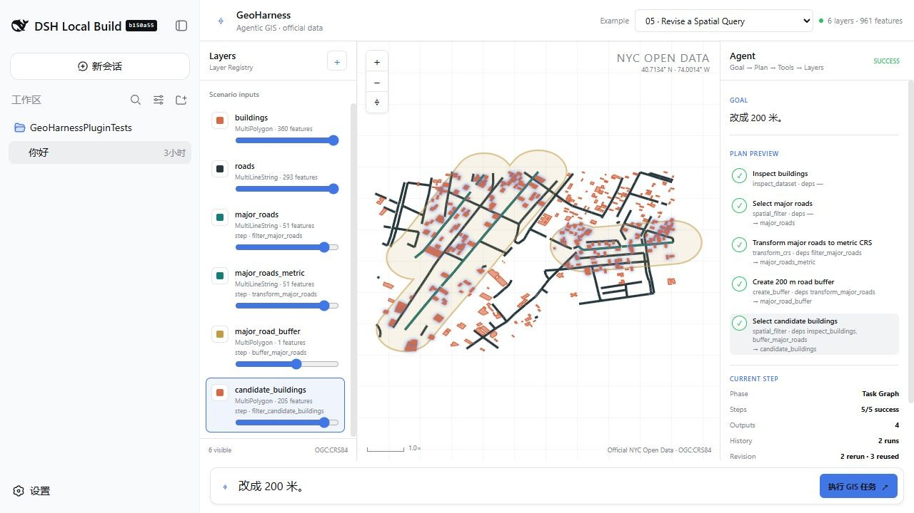
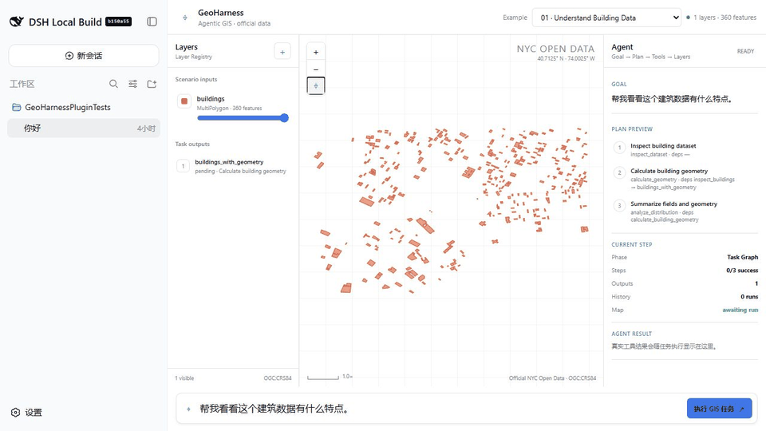
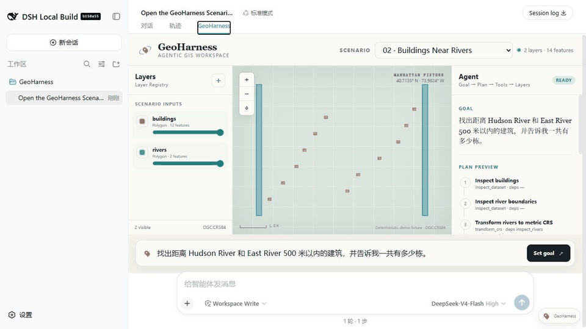
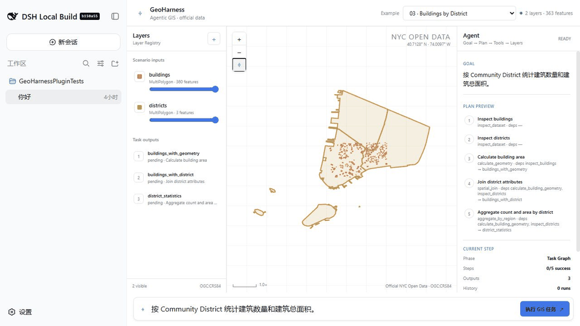
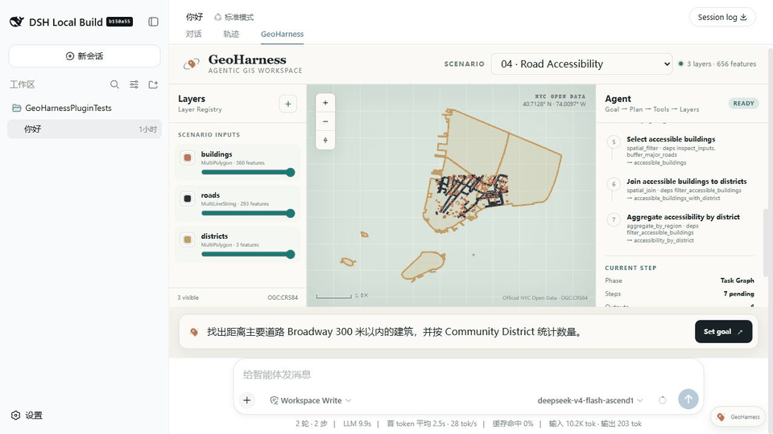
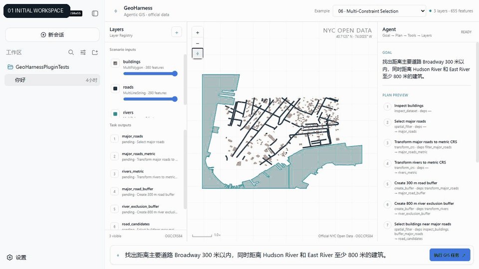
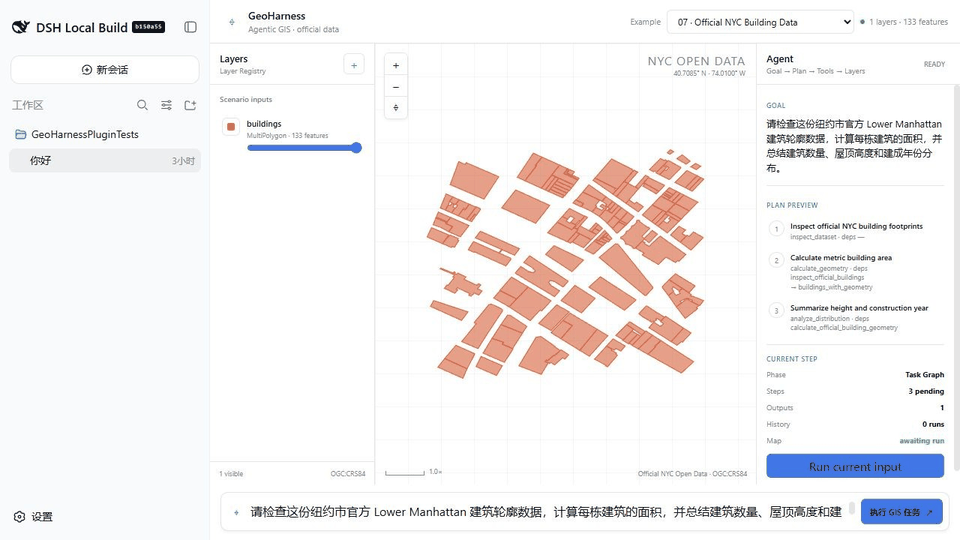

# GeoHarness

GeoHarness 是 DeepSeek Harness 的 Agentic GIS 插件。直接用自然语言描述空间分析需求，Agent 会选择数据与 GIS 工具，并同步展示执行过程、地图图层和最终结果。

开发者可从 [文档导航](docs/README.md) 开始阅读；当前主计划是 [GIS Agent 平台 v1.0 开发文档](docs/planning/geoharness-platform-v1.0.md)，最初方案保留为历史规划基线，真实 API 以 [当前 Harness 集成方式](docs/architecture/harness-integration.md) 为准。



## 安装

环境要求：Node.js `^22.19.0` 或 `>=24.0.0`、pnpm `11.22.0`、Python `>=3.11`。

```sh
git clone https://github.com/Star-Learning/GeoHarness.git
cd GeoHarness

pnpm install
python -m pip install -e "./backend/geo-service[test]"
pnpm run build

npx @deepseek-ai/dsh@0.1.1-rc.2 plugin --profile web add ./bundle/geoharness-bundle
npx @deepseek-ai/dsh@0.1.1-rc.2 web
```

打开 `http://127.0.0.1:3080` 即可使用。当前版本兼容 DeepSeek Harness `0.1.1-rc.2`。GeoHarness 以源码插件形式安装，因此请保留完整仓库目录，不要单独移动 `bundle/geoharness-bundle`。

卸载插件：

```sh
npx @deepseek-ai/dsh@0.1.1-rc.2 plugin --profile web remove @geoharness/harness-plugin
```

## 使用

1. 打开左下角“设置”，配置 LLM Provider、Base URL 和 API Key。
2. 新建或选择一个项目与会话。
3. 可点击顶部“导入数据”上传 GeoJSON、Shapefile ZIP、GeoPackage 或 CSV 经纬度文件；也可让 Agent 使用部署的数据目录。
4. 在右侧对话框输入 GIS 需求，例如：`找出距离 Broadway 275 米内的建筑，展示相关图层并报告数量。`
5. GeoHarness 会根据输入自动发现数据、规划步骤并调用 GIS 工具，不需要选择预设案例。
6. 右侧可查看 Agent 的流式输出和执行进度；中间地图会同步显示图层与结果，可拖动、缩放和查看要素。

## 案例

### 01 · 建筑数据检查

检查 360 个真实建筑要素的坐标系、字段、缺失值、几何有效性和面积统计。



### 02 · 河流周边建筑查询

为真实河流创建 500 米缓冲区，查询缓冲范围内的 132 栋建筑。



### 03 · 分区建筑统计

把 360 栋建筑与三个真实社区分区进行空间关联，并统计各分区的建筑数量和面积。



### 04 · Broadway 可达性分析

创建 Broadway 300 米服务范围，筛选附近 249 栋建筑并按社区分区汇总。



### 05 · 对话式参数修改

先分析 Broadway 500 米范围，再根据追问改为 200 米；复用未受影响的步骤并动态更新结果。


### 06 · 多条件选址

组合“距离 Broadway 300 米内”和“距离河流至少 800 米”两个条件，筛选出 27 栋建筑。



### 07 · NYC 官方建筑数据检查

检查纽约市官方数据中的 133 栋建筑，汇总几何质量、建造年份和屋顶高度。


