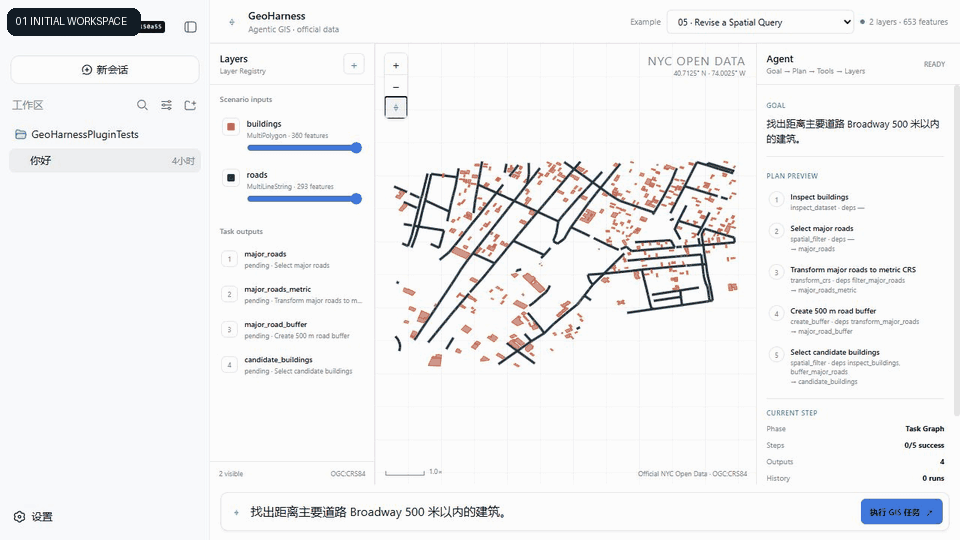

# GeoHarness v1.0

GeoHarness is an Agentic GIS workspace built as a real extension of DeepSeek Harness. A user states
a spatial goal; GeoHarness turns it into an executable Task Graph, runs structured Geo Tools,
registers every derived Layer, verifies the result on the map, and supports a bounded human
revision without hiding the GIS work behind chat prose.

> 你只需要告诉 GeoHarness 想解决什么空间问题；它会规划 GIS 工作流、执行分析，并把每一步结果展示在地图上供人验证。



This repository implements the complete currently feasible v1.0 scope against the inspected
DeepSeek Harness `0.1.1-rc.2` source at commit `b150a551`. It does not vendor or patch Harness
source, and it is not a separate Chat + Map website.

## What is implemented

- A dual-face Harness plugin/bundle: Host plugin plus browser module, composed through current
  `dsh.bundle`, `dsh.client`, Cordis Service and Harness Slot contracts.
- A three-column GIS workspace opened from the original conversation header through the official
  `conversation.session.header.actions` and `shell.overlay` surfaces: Layer Registry,
  interactive vector map and observable Agent Task Graph.
- Twelve model-facing Geo Tools with Harness schema validation, timeout/cancellation, structured
  `ToolResult` and prompt guidance.
- A cancellable local Python provider using GeoPandas, Shapely, PyProj and persistent GeoPackage
  workspaces.
- An executable DAG runtime with dependency resolution, state transitions, Layer aliases and run
  history.
- Verified `Task Step ↔ Layer ↔ Map` projection over the official loopback Connection RPC.
- Conversational Scenario 05 revision from 500 m to 200 m with downstream-only rerun and retained
  lineage.
- Seven independent Scenario packages, each with its own data, prompt, Task Graph, oracle-backed
  test, README, screenshots, animated Demo and video script.
- Every Scenario is backed by a dated, audited NYC Open Data snapshot and uses the same Tool,
  Layer Registry, Task Graph and map-verification path.

## Architecture

```text
DeepSeek Harness Web
  └─ conversation.session.header.actions + shell.overlay Slots
       └─ in-conversation GIS button + GeoHarness side workspace
            └─ official Connection RPC (/geoharness)
                 └─ TaskGraphRuntime + Map Verification
                      └─ 12 Harness defineTool consumers
                           └─ cancellable local Python provider
                                └─ GeoPandas / Shapely / PyProj / GeoPackage
```

The Registry is the Layer truth source. Agent text never invents Layer IDs or map state. A run is
reported ready only when step outputs, feature counts, parents and lineage all match the canonical
backend projection.

## Requirements

- Node.js `^22.19.0` or `>=24.0.0`
- pnpm `11.22.0`
- Python `>=3.11`
- A readable, built DeepSeek Harness checkout at `../deepseek-harness` for the source-integration
  workflow used by this repository

Install and build GeoHarness:

```sh
pnpm install
python -m pip install -e "./backend/geo-service[test]"
pnpm run build
```

The current upstream source CLI has a Node 24 `FiberState` source-entry issue, so use its built
entrypoint. A fully local/offline profile can link both checked-out bundles:

```powershell
$env:DSH_HOME = "$PWD/.tmp/dsh-home-geoharness"
node ../deepseek-harness/apps/cli/lib/bin.js plugin --profile geoharness add `
  ../deepseek-harness/packages/bundle/web-app ./bundle/geoharness-bundle --offline
node ../deepseek-harness/apps/cli/lib/bin.js --profile geoharness --no-open
```

If a Web-capable published Harness profile already exists, only add GeoHarness:

```sh
dsh plugin --profile web add ./bundle/geoharness-bundle
dsh --profile web --no-open
```

In Harness, open a session for this repository, click **GIS 地图** in the original conversation
header, select a Scenario and press **Run + verify on map**. GeoHarness does not add a separate
conversation tab. The frozen official-data workflows do not require a model API key.

## Seven official-data v1.0 Demos

| Scenario | Verified result | Package | Demo |
| --- | --- | --- | --- |
| 01 Building Data Inspection | 360 valid MultiPolygons; 0 missing height | [README](examples/scenarios/01-building-data-inspection/README.md) | [GIF](examples/scenarios/01-building-data-inspection/media/demo.gif) |
| 02 River Building Query | 132 buildings within 500 m | [README](examples/scenarios/02-river-building-query/README.md) | [GIF](examples/scenarios/02-river-building-query/media/demo.gif) |
| 03 Statistics by District | 360 buildings split 162 / 40 / 158 | [README](examples/scenarios/03-building-statistics-by-district/README.md) | [GIF](examples/scenarios/03-building-statistics-by-district/media/demo.gif) |
| 04 Broadway Accessibility | 249 candidates; District split 130 / 8 / 111 | [README](examples/scenarios/04-road-accessibility/README.md) | [GIF](examples/scenarios/04-road-accessibility/media/demo.gif) |
| 05 Parameter Revision | 500 m: 329 → 200 m: 205; 2 rerun / 3 reused | [README](examples/scenarios/05-parameter-revision/README.md) | [GIF](examples/scenarios/05-parameter-revision/media/demo.gif) |
| 06 Multi-Constraint Selection | 27 candidates satisfying both distances | [README](examples/scenarios/06-multi-constraint-selection/README.md) | [GIF](examples/scenarios/06-multi-constraint-selection/media/demo.gif) |
| 07 Official NYC Building Inspection | 133 valid MultiPolygons; 2 missing construction years; 1830–2021 | [README](examples/scenarios/07-official-nyc-building-inspection/README.md) | [GIF](examples/scenarios/07-official-nyc-building-inspection/media/demo.gif) |

Every Scenario follows the same rule:

```text
one need = one folder = one data package = one test = one Demo = one video script
```

Scenarios 01–06 use a frozen Lower Manhattan snapshot assembled from official NYC `BUILDING`,
`Centerline`, `Hydrography` and `Community District` datasets. The untouched downloaded responses
are kept under [`data/official-sources/nyc/`](data/official-sources/nyc/README.md); normalized derivatives are reproducible and every
Scenario still carries its own data copy. Source dataset IDs, queries, hashes, snapshot date and
processing steps are recorded there and in every Scenario README.

## Scenario 07 focused snapshot

Scenario 07 remains a focused, independent 133-feature Lower Manhattan snapshot from the NYC Open Data
`BUILDING` dataset (`5zhs-2jue`). Its fixed-bounds snapshot, publisher, query URL, source update,
processing, terms and independent GeoPandas oracle are committed with the Scenario.

## Verification

Run the complete build, all seven official-data regressions and the Python backend suite:

```sh
pnpm test
```

Run the final Phase 10 artifact gate, including media decoding and per-Scenario completeness:

```sh
pnpm run verify:phase10
```

Other useful commands:

```sh
pnpm run verify:phase9       # real RPC + GeoPandas 500 m → 200 m partial rerun
pnpm run check:official-data # verify official source hashes and derived statistics
pnpm run build:media         # rebuild GIFs from the committed real screenshots
pnpm run check:scenarios     # prove generated official-data packages are fresh
pnpm peers check             # confirm exact Harness peer compatibility
```

## v1.0 boundaries

- Vector data only: GeoJSON/GeoPackage/CSV export; no raster, point cloud or GEE pipeline.
- All seven regression Scenarios use committed, dated NYC Open Data snapshots. Refreshes must be
  explicit: download, hash validation, derivative rebuild, independent oracle and reviewed expected
  statistics must all pass before a source update is accepted.
- Natural-language revision is deliberately bounded to Scenario 05 distance changes with an
  explicit number and unit; arbitrary replanning is not claimed.
- No external model credential is stored in this repository. Tool schemas and deterministic GIS
  execution are tested through the real Harness runtime; model wording is not an acceptance
  oracle.
- Upstream version changes require rechecking bundle, client, Slot, Connection, Service and Tool
  contracts before upgrading the exact peers.

## Documentation

- [Verified Harness integration](docs/harness-integration.md)
- [Geo Tool contract](docs/tool-spec.md)
- [Task Graph runtime](docs/task-graph.md)
- [Map verification](docs/map-verification.md)
- [Scenario regression strategy](docs/scenario-regressions.md)
- [Conversational revision](docs/conversational-revision.md)
- [Implementation progress](PROGRESS.md)
- [Known constraints and resolved blockers](BLOCKERS.md)
