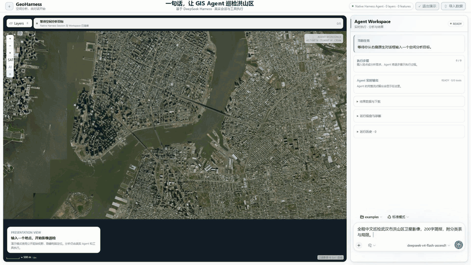

# GeoHarness

GeoHarness 是 **DeepSeek Harness 的 Agentic GIS 插件**。用自然语言描述需求，Agent 自动发现数据、选择工具，并同步展示执行过程、地图图层和分析报告。

[快速安装](#安装) · [开始使用](#使用) · [更多案例](#案例) · [开发文档](docs/README.md)

## 核心演示：一句话巡检卫星影像

> 巡检武汉市洪山区卫星影像，输出中文简报、分类表与局限。

**输入需求 → Agent 调用工具 → 地图定位 → 行政边界裁剪 → 巡检蒙版 → 图层控制与报告**



真实会话剪辑，约 28 秒。使用真实历史地名与 OSM 边界缓存，重新获取 Esri 影像并计算；这是 RGB 启发式视觉初筛，不是遥感分割模型或实测面积。[案例与来源](examples/topics/03-satellite-visual-inspection/README.md)

<details>
<summary>查看矢量分析主界面</summary>


</details>

## 安装

环境要求：Node.js `^22.19.0` 或 `>=24.0.0`、pnpm `11.22.0`、Python `>=3.11`。

```sh
git clone https://github.com/Star-Learning/GeoHarness.git
cd GeoHarness

pnpm install
python -m pip install -e "./backend/geo-service[test]"
pnpm run build

npx @deepseek-ai/dsh@0.1.1-rc.2 plugin --profile web add ./bundle/geoharness-bundle
npx @deepseek-ai/dsh@0.1.1-rc.2 web
```

打开 `http://127.0.0.1:3080`。兼容 DeepSeek Harness `0.1.1-rc.2`，环境详情见[兼容矩阵](docs/releases/compatibility-matrix.md)。请保留完整仓库，插件运行依赖其中的 Python 后端和数据目录。

<details>
<summary>卸载插件</summary>

```sh
npx @deepseek-ai/dsh@0.1.1-rc.2 plugin --profile web remove @geoharness/harness-plugin
```

</details>

## 使用

1. 打开左下角“设置”，配置 LLM Provider、Base URL 和 API Key，新建或选择项目与会话。
2. 做矢量分析时，导入 GeoJSON、Shapefile ZIP、GeoPackage 或 CSV 经纬度文件，也可使用已配置的数据目录；按地名巡检卫星影像时无需先导入矢量数据。
3. 在右侧输入需求。Agent 自动发现数据、规划步骤、调用工具，不需要选择预设案例；模型仍通过原生对话框切换。
4. 查看右侧流式输出、执行进度与报告，在地图上拖动、缩放，控制图层显隐和透明度。

可以试试：

- **影像巡检：**`巡检武汉市洪山区卫星影像，输出中文简报与分类表。`
- **空间查询：**`找出距离 Broadway 275 米内的建筑，展示相关图层并报告数量。`
- **继续追问：**`把范围改成 200 米，并导出结果。`

影像巡检需要访问 Esri / OpenStreetMap；地名或边界服务不可用时会明确说明。分析当前定位视野前，先点击地图工具栏的 `AI` 按钮授权。

## 案例

除了上面的影像巡检，还可查看[消防覆盖盲区](examples/topics/02-firehouse-coverage/README.md)等[综合分析专题](examples/topics/README.md)。以下七个真实数据案例各自保留独立数据、测试和 GIF。

<details>
<summary>展开七个矢量分析案例与 GIF</summary>

### 01 · 建筑数据检查

检查 360 个真实建筑要素的坐标系、字段、缺失值、几何有效性和面积统计。


### 02 · 河流周边建筑查询

为真实河流创建 500 米缓冲区，查询缓冲范围内的 132 栋建筑。


### 03 · 分区建筑统计

把 360 栋建筑与三个真实社区分区进行空间关联，并统计各分区的建筑数量和面积。


### 04 · Broadway 可达性分析

按到 Broadway 的 300 米直线距离筛选附近 249 栋建筑，并按社区分区汇总；不是道路网络行程时间分析。


### 05 · 对话式参数修改

先分析 Broadway 500 米范围，再根据追问改为 200 米；复用未受影响的步骤并动态更新结果。


### 06 · 多条件选址

组合“距离 Broadway 300 米内”和“距离河流至少 800 米”两个条件，筛选出 27 栋建筑。


### 07 · NYC 官方建筑数据检查

检查纽约市官方数据中的 133 栋建筑，汇总几何质量、建造年份和屋顶高度。


</details>
