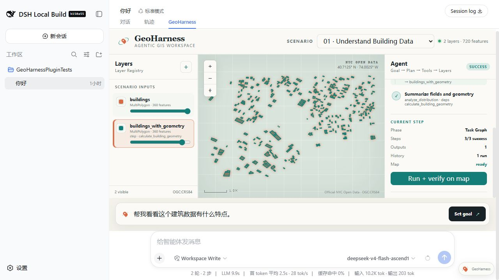

# Building Data Inspection

## Scenario

- ID: `01-building-data-inspection`
- Region: Lower Manhattan, New York City
- Data profile: `official-nyc-open-data-lower-manhattan-2026-08-27`

## Real user need

在不手工打开属性表或选择 GIS 工具的情况下理解一份建筑矢量数据。

## User prompt

> 帮我看看这个建筑数据有什么特点。

## Why this Demo exists

这个 Scenario 将一个真实空间需求、独立官方数据副本、可执行 Task Graph、期望 Plan、期望 Result 和回归入口放在同一目录中。提交后的快照可离线复现，不依赖运行时联网。

## Input data

| File | Dataset | Original provider | License / terms | Download / generation date |
| --- | --- | --- | --- | --- |
| `data/buildings.geojson` | NYC Open Data BUILDING (`5zhs-2jue`) | NYC Office of Technology and Innovation | [NYC Open Data Terms](https://opendata.cityofnewyork.us/overview/#termsofuse) | 2026-08-27 |

### Data source and processing

这些文件全部来自仓库内 `data/official-sources/nyc/` 的 NYC Open Data 固定快照。建筑数据从固定 bbox 的 2,622 个官方要素中做空间均匀的 360 要素系统抽样；道路保留官方四车道以上 Centerline，并将真实 Broadway 段标记为本 Demo 的 `major` corridor；District 使用官方 101–103 边界；Hudson/East River 由官方含水域边界减去陆地区边界后分侧得到。处理脚本不重画建筑、道路或 District 几何，完整来源、查询、哈希和条款见 [官方源数据说明](../../../data/official-sources/nyc/README.md)。

## Expected Agent behavior

1. Inspect dataset
1. Identify geometry and CRS
1. Summarize fields and missing values
1. Validate geometries
1. Calculate area and basic statistics
1. Present a map summary

## Key GIS workflow

`inspect_dataset` → `calculate_geometry` → `analyze_distribution`

可执行 DAG 定义位于 `task-graph.json`，每个步骤显式声明 dependencies、Layer 输入引用和 outputs。

## Success criteria

报告 360 个真实 MultiPolygon、OGC:CRS84、0 个缺失 height_m，且所有几何有效。

## Demo focus

AI 能不能自己看懂一份 GIS 数据？

## Demo artifacts



- [Initial Harness screenshot](screenshots/initial.jpg)
- [Animated Demo](media/demo.gif)
- [1–4 minute video script](media/video-script.md)

素材来自本 Scenario 在 DeepSeek Harness Web 中对 NYC Open Data 快照的真实执行：结果画面选择 `calculate_building_geometry`，360 个官方建筑输出同时在 Layer Registry 与地图高亮。

## Run and verify independently

```sh
node --test tests/regression/01-building-data-inspection.regression.test.mjs
```

该测试只读取本目录的数据、Task Graph 与 expected result，并用独立 GeoPandas oracle 验证 360 个真实要素、几何有效性、缺失值与面积统计。
