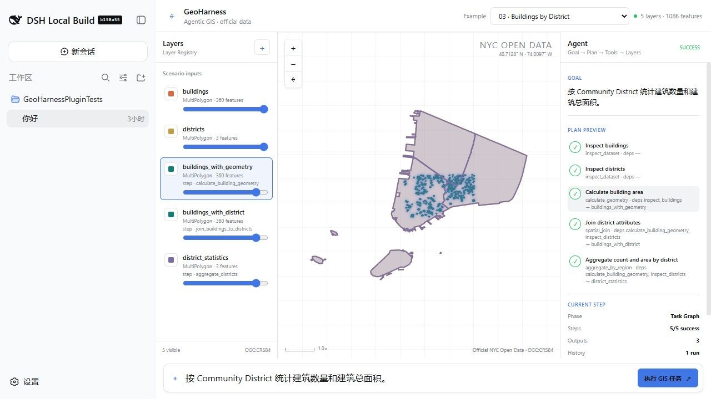

# Building Statistics by District

## Scenario

- ID: `03-building-statistics-by-district`
- Region: Lower Manhattan, New York City
- Data profile: `official-nyc-open-data-lower-manhattan-2026-08-27`

## Real user need

按行政区汇总建筑数量与面积，并把表格统计与专题图关联。

## User prompt

> 按 Community District 统计建筑数量和建筑总面积。

## Why this Demo exists

这个 Scenario 将一个真实空间需求、独立官方数据副本、可执行 Task Graph、期望 Plan、期望 Result 和回归入口放在同一目录中。提交后的快照可离线复现，不依赖运行时联网。

## Input data

| File | Dataset | Original provider | License / terms | Download / generation date |
| --- | --- | --- | --- | --- |
| `data/buildings.geojson` | NYC Open Data BUILDING (`5zhs-2jue`) | NYC Office of Technology and Innovation | [NYC Open Data Terms](https://opendata.cityofnewyork.us/overview/#termsofuse) | 2026-08-27 |
| `data/districts.geojson` | NYC Open Data Community Districts (`5crt-au7u`) | NYC Department of City Planning | [NYC Open Data Terms](https://opendata.cityofnewyork.us/overview/#termsofuse) | 2026-08-27 |

### Data source and processing

这些文件全部来自仓库内 `data/official-sources/nyc/` 的 NYC Open Data 固定快照。建筑数据从固定 bbox 的 2,622 个官方要素中做空间均匀的 360 要素系统抽样；道路保留官方四车道以上 Centerline，并将真实 Broadway 段标记为本 Demo 的 `major` corridor；District 使用官方 101–103 边界；Hudson/East River 由官方含水域边界减去陆地区边界后分侧得到。处理脚本不重画建筑、道路或 District 几何，完整来源、查询、哈希和条款见 [官方源数据说明](../../../data/official-sources/nyc/README.md)。

## Expected Agent behavior

1. Inspect buildings and districts
1. Calculate building area
1. Spatially join district attributes
1. Aggregate count and area
1. Render a thematic result

## Key GIS workflow

`inspect_dataset` → `calculate_geometry` → `spatial_join` → `aggregate_by_region`

可执行 DAG 定义位于 `task-graph.json`，每个步骤显式声明 dependencies、Layer 输入引用和 outputs。

## Success criteria

三个真实 Community District 分别统计到 162、40、158 个建筑，总计 360 个，面积总和为正。

## Demo focus

一句话让 AI 自动做分区统计。

## Demo artifacts



- [Initial Harness screenshot](screenshots/initial.jpg)
- [Animated Demo](media/demo.gif)
- [1–4 minute video script](media/video-script.md)
- [GIF keyframe storyboard](media/gif-storyboard.json)

真实结果画面选择 `aggregate_districts`，三个官方 `district_statistics` 面与该 Task step 同步高亮；输入、Join 中间层与聚合层均保留在 Layer Registry。
GIF 使用 7 个语义关键视图和 18 个平滑过渡帧，依次突出用户输入、Agent Plan、关键图层、地图和最终结果；所有画面均裁自上述真实 Harness 截图。

## Run and verify independently

```sh
node --test tests/regression/03-building-statistics-by-district.regression.test.mjs
```

回归测试只使用本目录官方建筑与 District 数据，独立确认 {"MN-101":162,"MN-102":40,"MN-103":158}、总计 360 个，并检查分区面积汇总为正。
