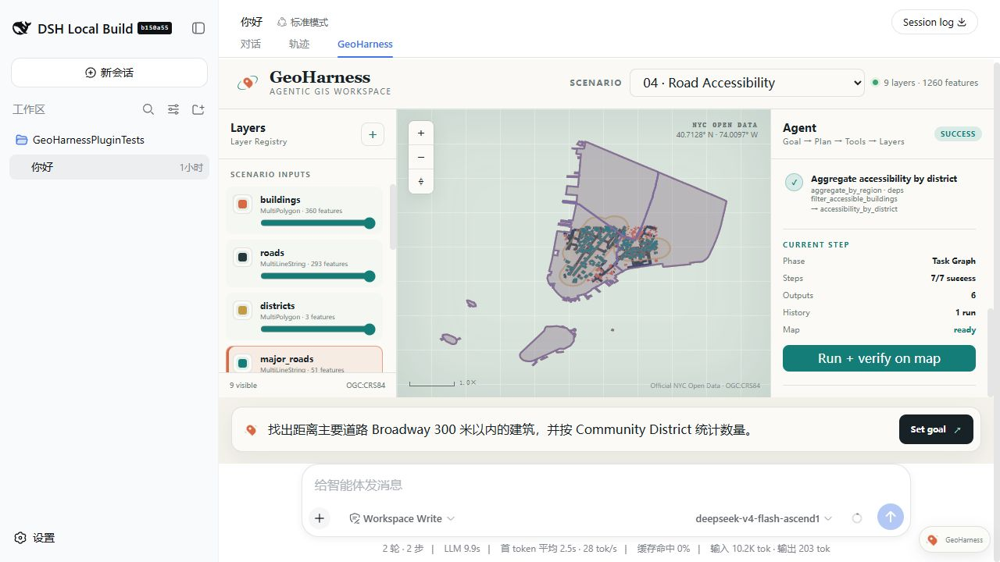

# Road Accessibility

## Scenario

- ID: `04-road-accessibility`
- Region: Lower Manhattan, New York City
- Data profile: `official-nyc-open-data-lower-manhattan-2026-08-27`

## Real user need

组合属性过滤、距离分析和分区统计来理解主要道路可达建筑。

## User prompt

> 找出距离主要道路 Broadway 300 米以内的建筑，并按 Community District 统计数量。

## Why this Demo exists

这个 Scenario 将一个真实空间需求、独立官方数据副本、可执行 Task Graph、期望 Plan、期望 Result 和回归入口放在同一目录中。提交后的快照可离线复现，不依赖运行时联网。

## Input data

| File | Dataset | Original provider | License / terms | Download / generation date |
| --- | --- | --- | --- | --- |
| `data/buildings.geojson` | NYC Open Data BUILDING (`5zhs-2jue`) | NYC Office of Technology and Innovation | [NYC Open Data Terms](https://opendata.cityofnewyork.us/overview/#termsofuse) | 2026-08-27 |
| `data/roads.geojson` | NYC Open Data Centerline (`inkn-q76z`) | NYC Office of Technology and Innovation | [NYC Open Data Terms](https://opendata.cityofnewyork.us/overview/#termsofuse) | 2026-08-27 |
| `data/districts.geojson` | NYC Open Data Community Districts (`5crt-au7u`) | NYC Department of City Planning | [NYC Open Data Terms](https://opendata.cityofnewyork.us/overview/#termsofuse) | 2026-08-27 |

### Data source and processing

这些文件全部来自仓库内 `data/official-sources/nyc/` 的 NYC Open Data 固定快照。建筑数据从固定 bbox 的 2,622 个官方要素中做空间均匀的 360 要素系统抽样；道路保留官方四车道以上 Centerline，并将真实 Broadway 段标记为本 Demo 的 `major` corridor；District 使用官方 101–103 边界；Hudson/East River 由官方含水域边界减去陆地区边界后分侧得到。处理脚本不重画建筑、道路或 District 几何，完整来源、查询、哈希和条款见 [官方源数据说明](../../../data/official-sources/nyc/README.md)。

## Expected Agent behavior

1. Identify roads where road_class is major
1. Transform to a metric CRS
1. Create a 300 m road buffer
1. Filter buildings
1. Join districts
1. Aggregate candidate counts

## Key GIS workflow

`inspect_dataset` → `spatial_filter` → `transform_crs` → `create_buffer` → `spatial_join` → `aggregate_by_region`

可执行 DAG 定义位于 `task-graph.json`，每个步骤显式声明 dependencies、Layer 输入引用和 outputs。

## Success criteria

筛选到 249 个 Broadway 300 m 可达建筑，并按三个真实 Community District 汇总。

## Demo focus

AI 能否自己组合多个 GIS 工具？

## Demo artifacts



- [Initial Harness screenshot](screenshots/initial.jpg)
- [Animated Demo](media/demo.gif)
- [1–4 minute video script](media/video-script.md)

真实结果画面选择 `filter_accessible_buildings`，249 个候选在 Broadway 300 m road buffer 内同步高亮；后续 District Join 与 aggregation step 同样保持可定位。

## Run and verify independently

```sh
node --test tests/regression/04-road-accessibility.regression.test.mjs
```

独立回归要求候选数为 249、分布为 {"MN-101":130,"MN-102":8,"MN-103":111}，并用 GeoPandas 复算每个候选到 Broadway 不超过 300 m。
