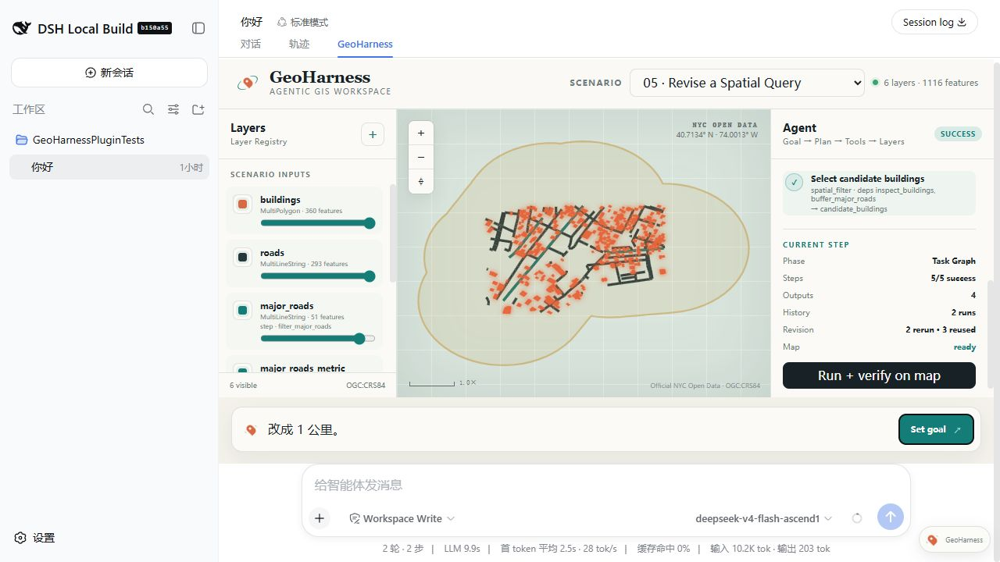

# Parameter Revision

## Scenario

- ID: `05-parameter-revision`
- Region: Lower Manhattan, New York City
- Data profile: `official-nyc-open-data-lower-manhattan-2026-08-27`

## Real user need

证明自然语言修改可以更新已有 GIS 工作流参数并只重算下游步骤。

## User prompt

> 找出距离主要道路 Broadway 500 米以内的建筑。

Revision: > 改成 1 公里。

## Why this Demo exists

这个 Scenario 将一个真实空间需求、独立官方数据副本、可执行 Task Graph、期望 Plan、期望 Result 和回归入口放在同一目录中。提交后的快照可离线复现，不依赖运行时联网。

## Input data

| File | Dataset | Original provider | License / terms | Download / generation date |
| --- | --- | --- | --- | --- |
| `data/buildings.geojson` | NYC Open Data BUILDING (`5zhs-2jue`) | NYC Office of Technology and Innovation | [NYC Open Data Terms](https://opendata.cityofnewyork.us/overview/#termsofuse) | 2026-08-27 |
| `data/roads.geojson` | NYC Open Data Centerline (`inkn-q76z`) | NYC Office of Technology and Innovation | [NYC Open Data Terms](https://opendata.cityofnewyork.us/overview/#termsofuse) | 2026-08-27 |

### Data source and processing

这些文件全部来自仓库内 `data/official-sources/nyc/` 的 NYC Open Data 固定快照。建筑数据从固定 bbox 的 2,622 个官方要素中做空间均匀的 360 要素系统抽样；道路保留官方四车道以上 Centerline，并将真实 Broadway 段标记为本 Demo 的 `major` corridor；District 使用官方 101–103 边界；Hudson/East River 由官方含水域边界减去陆地区边界后分侧得到。处理脚本不重画建筑、道路或 District 几何，完整来源、查询、哈希和条款见 [官方源数据说明](../../../data/official-sources/nyc/README.md)。

## Expected Agent behavior

1. Build and retain the initial Task Graph
1. Run a 500 m major-road query
1. Recognize a distance-only revision
1. Invalidate downstream steps
1. Rerun buffer and spatial filter at 1000 m
1. Preserve run history and lineage

## Key GIS workflow

`inspect_dataset` → `spatial_filter` → `transform_crs` → `create_buffer` → `spatial_filter`

可执行 DAG 定义位于 `task-graph.json`，每个步骤显式声明 dependencies、Layer 输入引用和 outputs。

## Success criteria

初始结果为 329 个真实建筑；修改后为 360 个；仅 buffer 及其下游步骤重跑。

## Demo focus

不是重新问一次，而是真正修改正在执行的 GIS 工作流。

## Demo artifacts



- [Initial Harness screenshot](screenshots/initial.jpg)
- [500 m result — 329 candidates](screenshots/result-500m.jpg)
- [1 km revised result — 360 candidates](screenshots/result-1km.jpg)
- [Animated revision Demo](media/demo.gif)
- [1–4 minute video script](media/video-script.md)

三帧动图来自同一个完整 Harness Web execution：先运行 500 m，再通过 `/geoharness/scenario/revise` 提交“改成 1 公里。”。修订画面真实显示 2 轮 history、`2 rerun · 3 reused` 和 360 个当前候选。

## Run and verify independently

```sh
node --test tests/phase9-conversational-revision.test.mjs
node --test tests/regression/05-parameter-revision.regression.test.mjs
```

第一项测试断言 329→360、只重跑 Buffer 与筛选、上游 Layer ID 复用、旧 Layer lineage 保留及当前地图 active projection；第二项验证本目录 500 m 初始结果。
