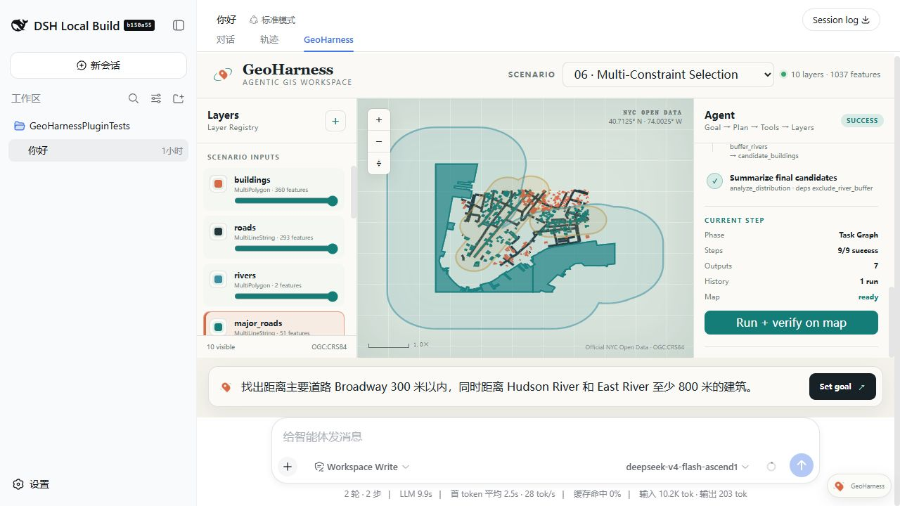

# Multi-Constraint Selection

## Scenario

- ID: `06-multi-constraint-selection`
- Region: Lower Manhattan, New York City
- Data profile: `official-nyc-open-data-lower-manhattan-2026-08-27`

## Real user need

把道路邻近与河流避让两个空间约束组合成可解释的布尔筛选工作流。

## User prompt

> 找出距离主要道路 Broadway 300 米以内，同时距离 Hudson River 和 East River 至少 800 米的建筑。

## Why this Demo exists

这个 Scenario 将一个真实空间需求、独立官方数据副本、可执行 Task Graph、期望 Plan、期望 Result 和回归入口放在同一目录中。提交后的快照可离线复现，不依赖运行时联网。

## Input data

| File | Dataset | Original provider | License / terms | Download / generation date |
| --- | --- | --- | --- | --- |
| `data/buildings.geojson` | NYC Open Data BUILDING (`5zhs-2jue`) | NYC Office of Technology and Innovation | [NYC Open Data Terms](https://opendata.cityofnewyork.us/overview/#termsofuse) | 2026-08-27 |
| `data/roads.geojson` | NYC Open Data Centerline (`inkn-q76z`) | NYC Office of Technology and Innovation | [NYC Open Data Terms](https://opendata.cityofnewyork.us/overview/#termsofuse) | 2026-08-27 |
| `data/rivers.geojson` | Community Districts land/water difference (`5crt-au7u`, `6ak9-vek3`) | NYC Department of City Planning | [NYC Open Data Terms](https://opendata.cityofnewyork.us/overview/#termsofuse) | 2026-08-27 |

### Data source and processing

这些文件全部来自仓库内 `data/official-sources/nyc/` 的 NYC Open Data 固定快照。建筑数据从固定 bbox 的 2,622 个官方要素中做空间均匀的 360 要素系统抽样；道路保留官方四车道以上 Centerline，并将真实 Broadway 段标记为本 Demo 的 `major` corridor；District 使用官方 101–103 边界；Hudson/East River 由官方含水域边界减去陆地区边界后分侧得到。处理脚本不重画建筑、道路或 District 几何，完整来源、查询、哈希和条款见 [官方源数据说明](../../../data/official-sources/nyc/README.md)。

## Expected Agent behavior

1. Parse both spatial constraints
1. Identify major roads
1. Transform to a metric CRS
1. Build 300 m road and 800 m river buffers
1. Select inside-road candidates
1. Exclude river-buffer candidates
1. Explain and map the final result

## Key GIS workflow

`inspect_dataset` → `spatial_filter` → `transform_crs` → `create_buffer` → `spatial_filter` → `analyze_distribution`

可执行 DAG 定义位于 `task-graph.json`，每个步骤显式声明 dependencies、Layer 输入引用和 outputs。

## Success criteria

得到 27 个同时满足 road distance <= 300 m 且 river distance >= 800 m 的真实建筑。

## Demo focus

从单个 Tool Calling 升级到真正的 Agent Planning。

## Demo artifacts



- [Initial Harness screenshot](screenshots/initial.jpg)
- [Animated Demo](media/demo.gif)
- [1–4 minute video script](media/video-script.md)
- [GIF keyframe storyboard](media/gif-storyboard.json)

真实结果画面选择 `exclude_river_buffer`，道路邻近和河流排除两类 Buffer 同时可见，最终 27 个 `candidate_buildings` 与 Task step 同步高亮。
GIF 使用 7 个语义关键视图和 18 个平滑过渡帧，依次突出用户输入、Agent Plan、关键图层、地图和最终结果；所有画面均裁自上述真实 Harness 截图。

## Run and verify independently

```sh
node --test tests/regression/06-multi-constraint-selection.regression.test.mjs
```

独立回归验证结果为 27，并分别复算 road distance ≤ 300 m、river distance ≥ 800 m。
