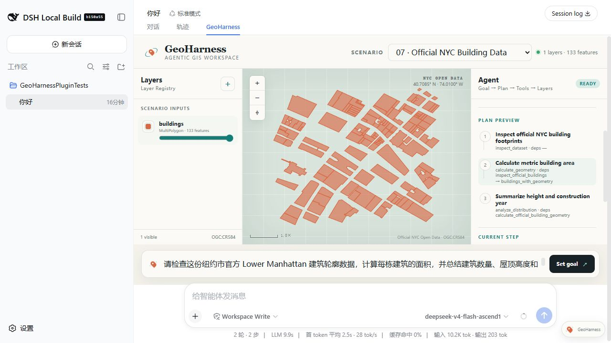
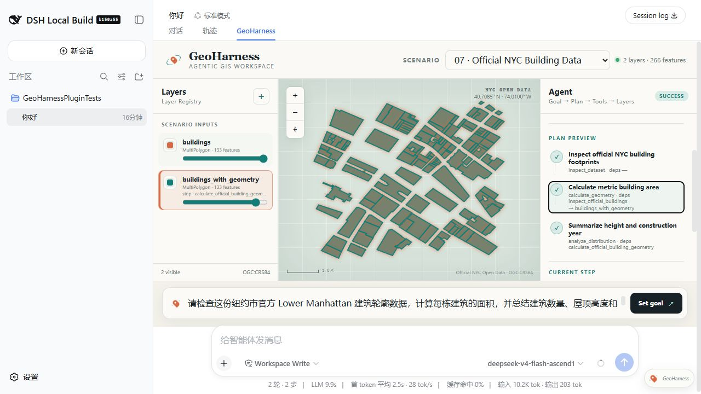

# Official NYC Building Inspection

## Real user need

在不上传整座城市大数据的前提下，用一小块官方真实建筑数据检查 GeoHarness 是否能完成真实数据加载、字段检查、面积计算、统计与地图验证。

## User prompt

> 请检查这份纽约市官方 Lower Manhattan 建筑轮廓数据，计算每栋建筑的面积，并总结建筑数量、屋顶高度和建成年份分布。

## Input data

| File | Publisher | Dataset | Snapshot | Terms |
| --- | --- | --- | --- | --- |
| `data/buildings.geojson` | NYC Office of Technology and Innovation (OTI) | [NYC Open Data BUILDING (`5zhs-2jue`)](https://data.cityofnewyork.us/d/5zhs-2jue) | 2026-08-27 | [NYC Open Data Terms of Use](https://opendata.cityofnewyork.us/overview/#termsofuse) |

### Data source and processing

这不是 GeoHarness 生成的 fixture。下载器对官方 Socrata GeoJSON API 使用固定的 Lower Manhattan `within_box`：north `40.7110`、west `-74.0130`、south `40.7060`、east `-74.0070`，按 `OBJECTID` 排序，并选择官方几何、BIN、建成年份、屋顶高度、地面高程、几何来源与编辑日期字段。

几何坐标未经简化或重画，仅把 Socrata 的数字字符串规范化为数值并统一字段名。当前审计快照包含 133 个官方 MultiPolygon。可重复下载命令：

```powershell
./scripts/download-nyc-building-demo.ps1
```

官方数据会更新，因此刷新后若要提交新的快照，必须重新计算并审查预期统计，不能静默接受数量变化。

## Expected Agent behavior

1. 读取并检查官方建筑 Layer 的 CRS、几何、字段、缺失值和有效性。
2. 使用 UTM 18N（EPSG:32618）计算每栋建筑的面积与周长。
3. 汇总屋顶高度、建成年份和计算面积的分布。
4. 将派生 Layer 与 Task step 绑定，并在地图中显示全部真实建筑轮廓。
5. 只报告 ToolResult 与独立 oracle 验证过的结果。

## Key GIS workflow

`inspect_dataset` → `calculate_geometry` → `analyze_distribution`

## Success criteria

- 133 个 MultiPolygon，0 个无效几何。
- 屋顶高度字段无缺失；建成年份缺失 2 条。
- 已知建成年份范围为 1830–2021。
- 派生 `buildings_with_geometry` Layer 含正的总建筑面积。
- Map Verification 对 step output、feature count、parents 与 lineage 全部通过。

## Demo focus

相同的 GeoHarness Agent 工作流能否处理来源可审计的官方真实数据，而不是只处理为测试设计的合成图形？

### Harness UI screenshots

| Initial official Layer | Verified result and derived Layer |
| --- | --- |
|  |  |


视频口播与镜头说明见 [media/video-script.md](media/video-script.md)。截图来自本仓库接入的
DeepSeek Harness `conversation.view`，不是另建的地图页面。

## Run and verify independently

```sh
node --test tests/scenarios/07-official-nyc-building-inspection.test.mjs
node --test tests/regression/07-official-nyc-building-inspection.regression.test.mjs
node --test tests/official-real-data-demo.test.mjs
```
