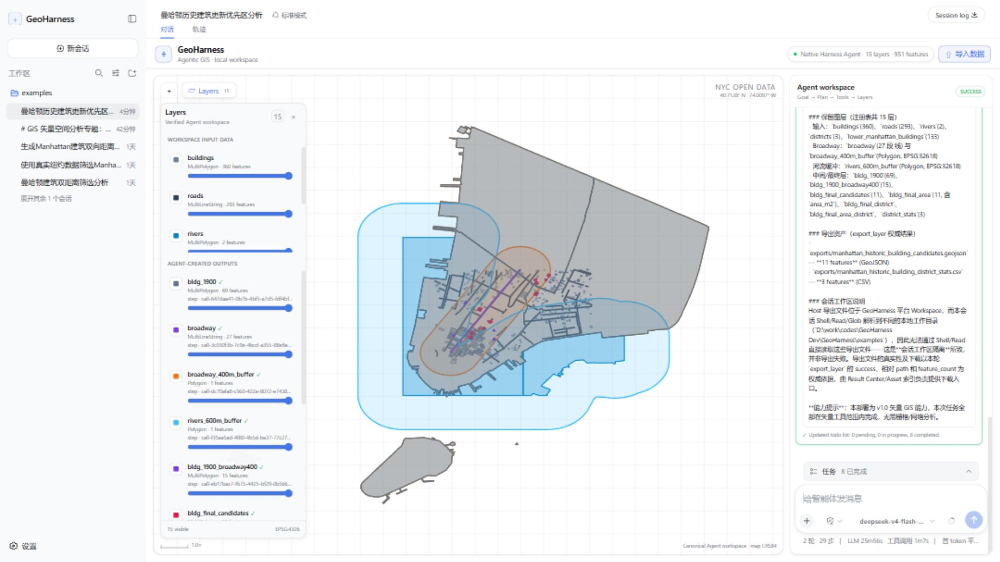

# 曼哈顿历史建筑更新优先区

本 Topic 以真实 NYC 官方矢量数据展示 GeoHarness Agent 从自然语言目标到可核查空间结果的完整流程。

## 分析链路

```text
数据发现与字段检查
→ construction_year = 1900 属性筛选
→ Broadway 400 m 缓冲
→ Hudson/East River 600 m 避让
→ 多约束候选叠加
→ EPSG:32618 占地面积计算
→ Community District 聚合
→ GeoJSON / CSV 导出
→ 会话修订与最终报告
```

实际 Tool Result 得到：

- 360 栋输入建筑中有 69 栋建于 1900 年；
- 15 栋与 Broadway 400 米范围相交；
- 11 栋同时避开河流 600 米范围；
- 最终总占地 4426.92 m²；
- CD 101 / 102 / 103 分别为 6 / 4 / 1 栋；
- 导出 11 要素 GeoJSON 和 3 要素 CSV。

Agent 在首次分区聚合时遇到重名字段语义问题，自主改用“面积候选层 + 原始分区层”后成功；随后用户通过同一会话终止无效的跨 Workspace 路径搜索，并要求以 Result Center 资产索引完成报告。视频保留了这一真实诊断与修订过程。

## 资产

- [`prompt.md`](prompt.md)：完整输入 Prompt；
- 本地视频 `media/agent-flow-1080p.mp4`：1920×1080、30 fps、H.264 High，17 分 42 秒；
- [`media/recording.json`](media/recording.json)：Prompt 哈希、帧数和真实结果清单；
- [`media/final.png`](media/final.png)：最终成功画面。



视频 SHA256：`81643ED784FC31BB780D42800AC9BCDC698901F87C66F3E4650E55A781511CAB`。
